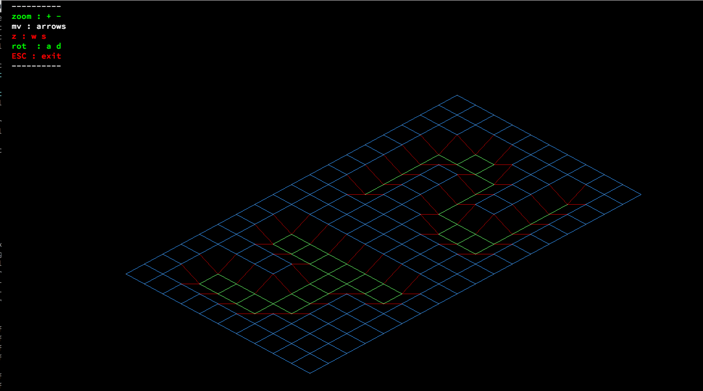
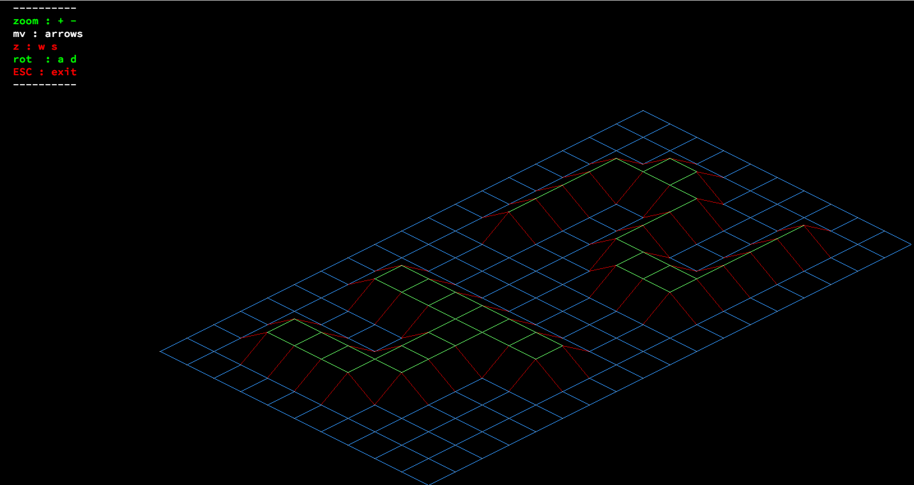
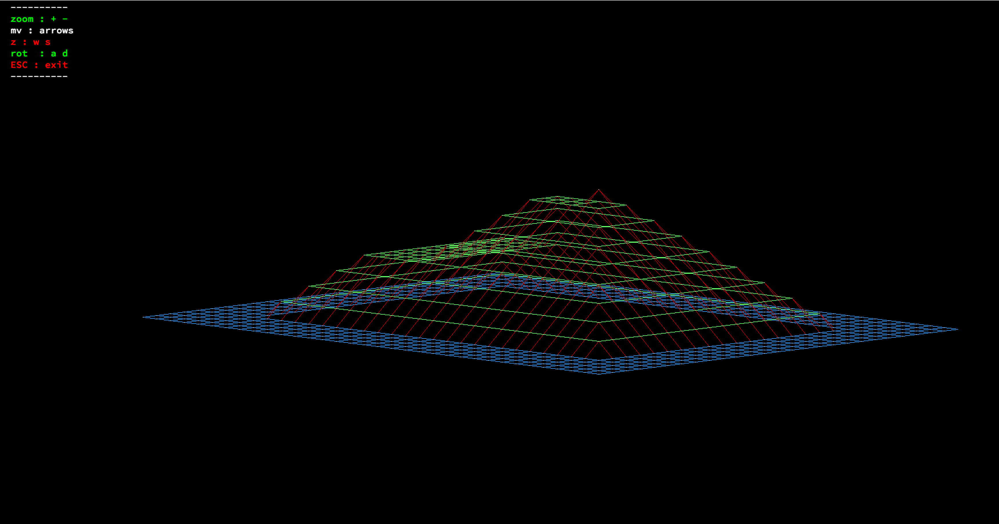
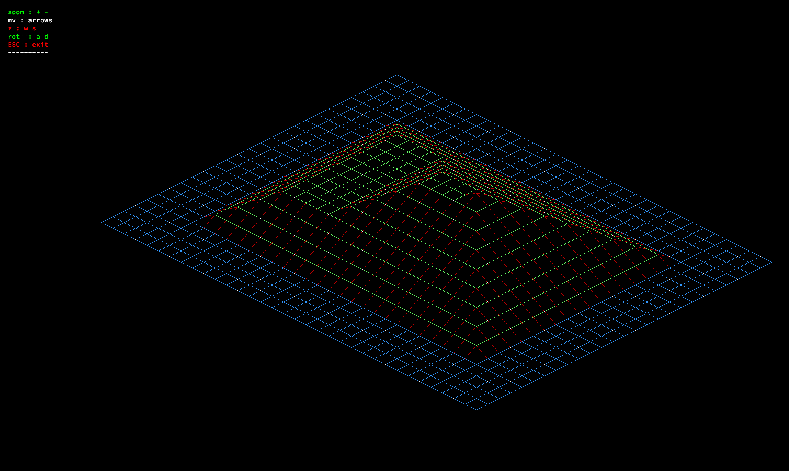
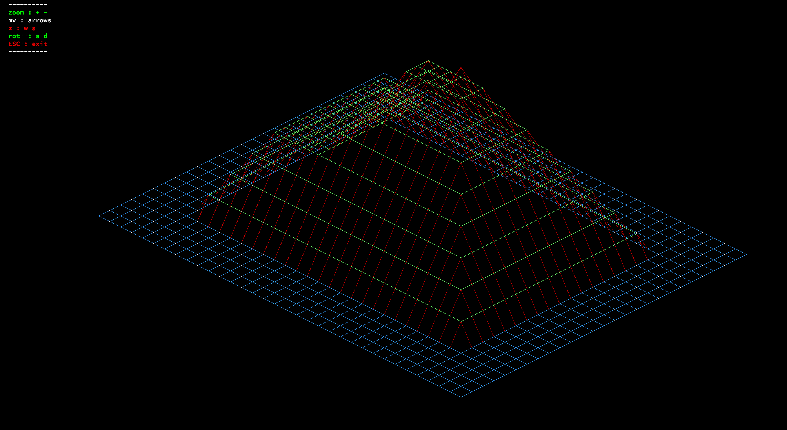
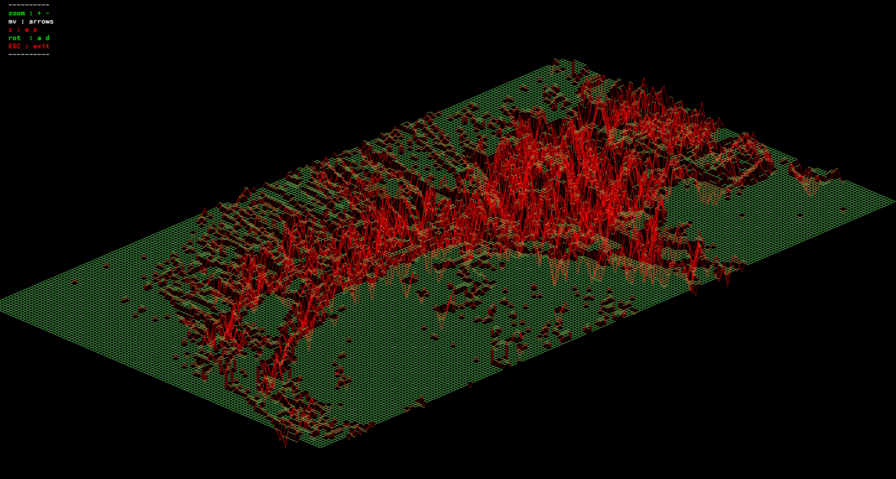

# FdF
###### Ecole 42 - First project of the graphic path

This project consists in graphically creating the schematic representation ("wireframe") of a terrain in relief by
connecting different points (x, y, z) by segments.
The coordinates of the field will be stored in a file passed in parameter.

## Getting Started

Follow the instructions to get a copy of the project and run it on your local machine for development and testing purposes.

### Prerequisites

```
MacOs/Linux environment
```
### Launch
```

make

./fdf test_maps/[map]

```

### Features
- complex maps rendering
- zoom
- rotation trough horizontal x axe
- z-axe increase/decrease
- deplacement







